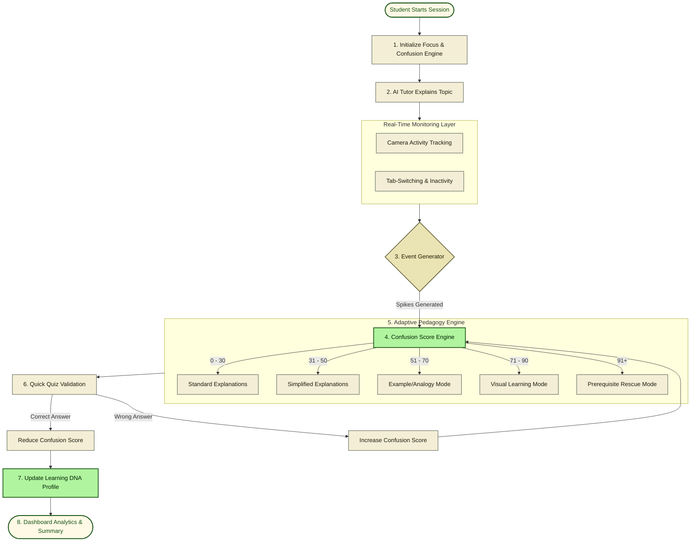
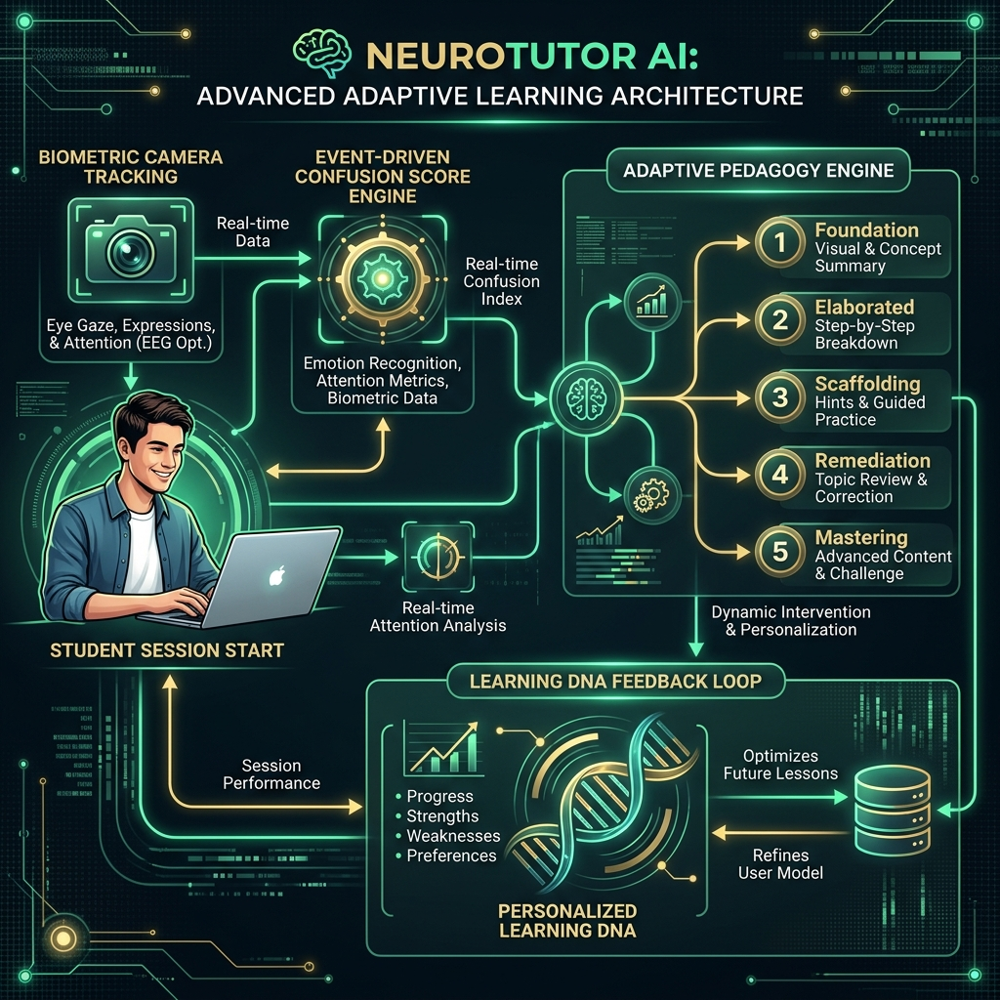

# NeuroTutor AI — Emotion-Aware Virtual Learning Assistant

Created with ❤️ by **Team Rookie**

🚀 **Live Demo**: [neurolearnaitutor.vercel.app](https://neurolearnaitutor.vercel.app)

---

## Overview

**NeuroTutor AI** is an Emotion-Aware Virtual Learning Assistant that continuously monitors student engagement and learning behavior. Instead of providing the same static explanation to every student, the system detects confusion through behavioral events and dynamically adapts its teaching strategy in real time.

The platform follows a neuromorphic-inspired event-driven architecture where meaningful learning events generate "spikes" that influence the tutor's decisions.

---

## Team Name: **Team Rookie**

*Committed to building adaptive, event-driven cognitive systems that respond to user emotional states and learning progress in real time.*

---

## Repository Structure

Below is the directory tree of the `Neurolearn_aitutor` codebase:

```text
📂 Neurolearn_aitutor (Project Root)
 ├── ⚙️ .gitignore                          # Standard Git configuration ignoring build files & lockfiles
 ├── ⚙️ .prettierignore                      # Files and folders ignored by Prettier formatter
 ├── ⚙️ .prettierrc                          # Prettier code formatting rules
 ├── 📝 README.md                            # Main project documentation (this file)
 ├── ⚙️ components.json                     # Configuration file for Shadcn UI components
 ├── ⚙️ eslint.config.js                    # ESLint rules for static code analysis
 ├── 📦 package-lock.json                   # NPM dependency lockfile
 ├── 📦 package.json                        # Project dependencies, scripts, and metadata
 ├── ⚙️ tsconfig.json                       # TypeScript compiler options
 ├── ⚙️ vite.config.ts                      # Vite build tool & development server configuration
 ├── 📂 designs/                             # Mockups, design specifications, and asset previews
 │   ├── 📂 academic_warmth/
 │   │   └── 📝 DESIGN.md                    # Detailed pedagogy study notes
 │   ├── 📂 ai_tutor_neurotutor_ai/
 │   │   └── 🖼️ screen.png                  # Study Space UI mockup preview
 │   ├── 📂 analytics_learning_dna_neurotutor_ai/
 │   │   └── 🖼️ screen.png                  # Learning DNA dashboard mockup preview
 │   ├── 📂 dashboard_neurotutor_ai/
 │   │   └── 🖼️ screen.png                  # Student dashboard mockup preview
 │   └── 📂 landing_page_neurotutor_ai/
 │       └── 🖼️ screen.png                  # Landing Page mockup preview
 ├── 📂 public/                              # Static public assets served to the client
 │   └── 📂 app/                             # Core front-end application pages
 │       ├── 🌐 index.html                  # Landing page entry point
 │       ├── 📂 ai_tutor_neurotutor_ai/
 │       │   └── 🌐 code.html               # AI Tutor Study Space & chat simulator
 │       ├── 📂 analytics_learning_dna_neurotutor_ai/
 │       │   └── 🌐 code.html               # Learning DNA analytics page
 │       ├── 📂 dashboard_neurotutor_ai/
 │       │   └── 🌐 code.html               # Student Dashboard interface
 │       └── 📂 landing_page_neurotutor_ai/
 │           └── 🌐 code.html               # Landing Page backup layout
 └── 📂 src/                                 # TanStack React wrapper codebase
     ├── ⚙️ routeTree.gen.ts                 # Generated routing tree for TanStack Router
     ├── 🎨 styles.css                       # Tailwind CSS imports & Design System custom variables
     ├── 📂 app/
     │   ├── ⚡ router.tsx                     # TanStack Router initialization
     │   ├── ⚡ server.ts                     # SSR helper for TanStack Start
     │   └── ⚡ start.ts                      # Entrypoint wrapper for React app hydration
     ├── 📂 assets/                            # Production assets used by React components
     ├── 📂 features/                          # Feature directories for logical modularity
     │   ├── 📂 adaptive-learning/           # Adaptive pedagogy modules
     │   ├── 📂 analytics/                   # Analytics modules
     │   ├── 📂 assessments/                 # Quiz & metrics tracking
     │   └── ...                             
     ├── 📂 routes/
     │   ├── ⚡ index.tsx                     # Redirects root route to /app/index.html
     │   ├── 📝 README.md
     │   └── ⚡ __root.tsx                    # Master layout, styles injector, and global metadata
     ├── 📂 services/                          # Core system drivers and API clients
     │   ├── 📂 ai/                          # AI integration services
     │   ├── 📂 api/                         # Backend API handlers
     │   ├── 📂 camera/                      # Camera/face tracking integration
     │   └── 📂 websocket/                   # Real-time event communication
     └── 📂 shared/                            # Shared components, hooks, utilities, and constants
         ├── 📂 components/
         │   ├── 📂 Button/
         │   │   └── ⚡ button.tsx
         │   ├── 📂 Charts/
         │   │   └── ⚡ chart.tsx
         │   ├── 📂 Sidebar/
         │   │   └── ⚡ sidebar.tsx
         │   └── 📂 ui/                      # Reusable base Shadcn UI components
         │       └── ⚡ button.tsx, accordion.tsx, card.tsx, etc.
         ├── 📂 constants/
         ├── 📂 hooks/
         │   └── ⚡ use-mobile.tsx           # Responsive mobile layout hook
         └── 📂 utils/                       # Helper functions, config variables, and error logging
             ├── ⚡ config.server.ts
             ├── ⚡ error-capture.ts
             ├── ⚡ error-page.ts
             ├── ⚡ tutor-error-reporting.ts
             └── ⚡ utils.ts
```

---

## System Flow & Architecture



### System Architecture Infographic


### 1. Session Initialization
When a learning session begins:
1. Student selects a subject and topic.
2. The user's camera is activated for real-time engagement tracking.
3. The AI Tutor session starts and initializes the:
   * Focus Score
   * Confusion Score
   * Learning Session State
   * Event Tracking Engine

### 2. Engagement Monitoring Layer
The platform continuously collects active learning signals:
* **Behavioral Signals**: Face Present/Absent, Looking At Screen/Looking Away, Tab Switching, Inactivity.
* **Learning Signals**: Correct/Wrong Answers, Hint Requests, "Explain Again" Requests, Quiz Performance.

### 3. Event Generation Engine (Neuromorphic Spikes)
Instead of continuously modifying explanations, the system operates using event-driven generation. It waits for meaningful learning events to generate "spikes" that affect the tutoring logic.
* **Key Events**: `FOCUS_LOST`, `FOCUS_REGAINED`, `WRONG_ANSWER`, `CORRECT_ANSWER`, `HINT_REQUESTED`, `EXPLAIN_AGAIN`, `TOPIC_COMPLETED`, `USER_ABSENT`.

Example Event Object:
```json
{
  "event": "FOCUS_LOST",
  "timestamp": "2026-06-14T10:00:00"
}
```

### 4. Confusion Score Engine
Each learning event contributes to a dynamic, real-time confusion score:

| Event | Score Impact |
| --- | --- |
| **Wrong Answer** | +20 |
| **User Absent** | +15 |
| **Explain Again** | +15 |
| **Hint Request** | +10 |
| **Focus Lost** | +10 |
| **Focus Regained** | -5 |
| **Correct Answer** | -10 |

### 5. Confusion Spike Detection
When the confusion score crosses predefined thresholds, the system generates a **Confusion Spike** that triggers adaptive teaching modes:
* **0 - 30**: Low Confusion
* **31 - 50**: Moderate Confusion
* **51 - 70**: High Confusion
* **71 - 90**: Very High Confusion
* **91+**: Critical Confusion (Triggers Rescue Mode)

### 6. Adaptive Teaching Engine
The AI tutor changes its teaching strategy according to the current confusion level:
* **Mode 1 — Standard Explanation (Confusion 0-30)**: Normal academic explanations.
* **Mode 2 — Simplified Explanation (Confusion 31-50)**: Simpler language, bullet points, and shorter explanations.
* **Mode 3 — Example Mode (Confusion 51-70)**: Real-world analogical explanations (e.g., using Cars or Footballs to explain physics).
* **Mode 4 — Visual Learning Mode (Confusion 71-90)**: Renders interactive flowcharts, diagrams, concept maps, and SVGs.
* **Mode 5 — Rescue Mode (Confusion 91+)**: Detects prerequisite knowledge gaps. For example, if Newton's Laws are failing because of a lack of understanding in *Force* or *Motion*, the engine halts the lesson, teaches the prerequisite concepts first, and then returns to the main topic.

### 7. Quick Quiz Validation
After every explanation adaptation cycle, the student is presented with a Quick Quiz:
* **Success (Correct Answers)**: Generates a `MASTERY` event, reducing the confusion score.
* **Failure (Wrong Answers)**: Generates another `CONFUSION` event, prompting the next, more supportive teaching mode.

### 8. Learning DNA Engine
The platform builds a personalized cognitive profile over time by assessing which explanation types yield the best quiz performance:
* **Visual Learning Weight**: e.g., 70%
* **Example-Based Weight**: e.g., 20%
* **Textual Learning Weight**: e.g., 10%
* Future sessions automatically prioritize the most effective learning mode.

### 9. Smart Learning Environment (Focus Lock)
To prevent distractions:
* **Allowed Content**: Wikipedia, research papers, educational channels, standard learning domains.
* **Blocked Content**: Social media, video games, entertainment portals, short-form video content.
* **Focus Check**: Repeated tab-switching or focus loss triggers a `FOCUS_LOST` event, causing the tutor to check in on the student and offer simplified materials.

### 10. Session Intelligence Summary
When a session ends, the app generates a personalized session report capturing:
* Focus Score average
* Peak Confusion score
* Correct/Wrong counts
* Strong and Weak concepts identified
* Custom learning recommendations

### 11. Analytics Dashboard
The dashboard visualizes learning intelligence:
* **Topic Difficulty Heatmap**: Highlights which topics took the most time or caused the most confusion spikes.
* **Learning Events Timeline**: Shows events chronological order (e.g., `2:15 PM Confusion Spike`, `2:22 PM Focus Recovery`, `2:50 PM Rescue Mode`).
* **Learning DNA Analytics**: Displays visual vs. example vs. text learning preferences.

---

## Innovation Summary

NeuroTutor AI is a next-generation learning application combining:
1. **Biometric & Behavioral Telemetry**: Utilizing camera and tab tracking to monitor focus.
2. **Event-Driven Spiking Architecture**: Inspired by neuromorphic principles to update logic dynamically on spikes.
3. **Multi-Modal Adaptability**: Tailors pedagogy through 5 levels of explanation (textual, simple, analogical, visual, and prerequisite rescue).
4. **Distraction Prevention**: Integrated focus locking to keep students on task.